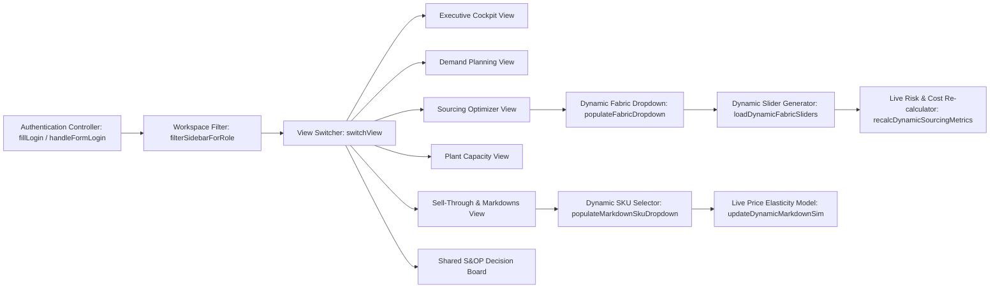

# TrendWear Integrated S&OP Enterprise Suite
## Document 3: Technical Architecture, Codebase Design, and Technology Justification

---

### 1. System Architecture Overview

The TrendWear Integrated S&OP platform is engineered as a decoupled, multi-tiered enterprise web application. It integrates high-performance mathematical optimization, in-memory relational data modeling, and a reactive role-segmented user interface.

```mermaid
flowchart TD
    subgraph CLIENT_TIER [Client Presentation Tier: Browser]
        UI1[Role-Segmented Navigation: Executive, Planner, Procurement, Production, Logistics]
        UI2[Dynamic Multi-Vendor Sourcing Sliders & Fabric Selector]
        UI3[Dynamic SKU Markdown Elasticity Controller]
        UI4[Universal 1-Click Purchase Order Release Modal]
        UI5[6-Week Lifecycle Time-Travel Simulation Player]
        UI6[Real-Time Activity Feed Drawer]
    end

    subgraph SERVER_TIER [Application & API Gateway Tier: Python 3.10+]
        S1[Multi-Threaded HTTP Server: ThreadedHTTPServer & SOPHandler]
        S2[REST API Routing Gateway: 14 Endpoints]
        S3[Cache-Control & Security Headers Layer]
        S4[JSON Serialization & Error Boundary]
    end

    subgraph ENGINE_TIER [Computational & Optimization Engine Tier]
        E1[Data Loader: Relational Join & Cache Manager]
        E2[MRP Engine: Multi-Echelon BOM Explosion]
        E3[Sourcing Optimizer: PuLP Mixed-Integer Linear Program MILP]
        E4[Capacity Engine: Plant Utilization & Line Rebalancer]
        E5[Markdown Engine: In-Season Velocity & Price Elasticity]
        E6[Financial Engine: P&L Waterfall & Margin Hurdle]
        E7[Workflow Engine: 5-Stage S&OP State Machine & Audit]
        E8[Scenario Simulator: Interactive What-If Sub-Second Solver]
        E9[Pipeline Orchestrator: End-to-End Computational Pipeline]
    end

    subgraph DATA_TIER [Relational Data & File Storage Tier]
        D1[Master Datasets: 8 CSV Schemas in data/master/]
        D2[Transactional Feeds: 7 CSV Schemas in data/demand, data/production, etc.]
        D3[Generated Artifacts: S&OP Plans in data/outputs/]
    end

    CLIENT_TIER <-->|HTTP REST JSON Payloads & Zero-Cache Assets| SERVER_TIER
    SERVER_TIER <-->|Method Invocations & DataFrame Slices| ENGINE_TIER
    ENGINE_TIER <-->|Disk I/O & In-Memory Vector Operations| DATA_TIER
```

---

### 2. Technology Stack Selection and Technical Justification

| Layer / Tool | Technology Selected | Alternatives Considered | Technical Justification and Trade-off Analysis |
|---|---|---|---|
| **Backend Runtime** | Python 3.10+ Standard Library (`http.server`, `socketserver`, `threading`, `json`) | Node.js / Express, Flask, FastAPI, Django | Zero external dependencies for the HTTP layer guarantees instant deployment without packaging failures. Python natively interfaces with scientific computing libraries (`pandas`, `pulp`, `scipy`). |
| **Optimization Solver** | PuLP Mixed-Integer Linear Programming (MILP) with CBC Solver | SciPy `linprog`, Gurobi, CPLEX, Custom Heuristics | PuLP supports exact discrete integer variables required for Minimum Order Quantities (MOQ) and binary supplier activation ($y \in \{0,1\}$). Gurobi/CPLEX require expensive commercial licenses. The bundled CBC solver executes 150-variable problems in $<0.08\text{ seconds}$. |
| **Data Processing Layer** | Pandas In-Memory Vectorized DataFrames | SQLite, PostgreSQL, DuckDB, Polars | Fast-fashion planning involves interactive matrix operations (BOM explosion across 50 styles $\times$ 30 fabrics). In-memory DataFrames provide microsecond slicing without database connection overhead or disk lock bottlenecks. |
| **Client Core** | Vanilla ES6+ JavaScript & HTML5 Semantic Structure | React, Angular, Vue, Next.js | Eliminates heavy node_modules dependencies, Webpack/Vite build steps, and hydration delays. Pure ES6 executes instantaneously in any modern browser with zero build pipeline friction. |
| **Styling & Design System** | Vanilla CSS3 (Custom Design Tokens, Flexbox, CSS Grid, Glassmorphism) | Tailwind CSS, Bootstrap, Material UI | Total control over typography, custom micro-meters, glassmorphism cards, and responsive sidebar filters without CSS purging bugs or framework version incompatibilities. |
| **Visualization Layer** | Chart.js (CDN-delivered Canvas rendering) | D3.js, Recharts, Plotly | Canvas-based rendering delivers high-performance 60 FPS animations for line charts, stacked category bars, and donut splits with minimal memory footprint. |

---

### 3. Module-by-Module Engine Specification

#### 3.1. `engine/data_loader.py`
* **Purpose**: Ingestion, type-casting, validation, and caching of all 15 relational CSV datasets.
* **Key Functions**:
  - `load_all_data() -> Dict[str, pd.DataFrame]`: Reads master, operational, and transactional tables into memory.
  - `get_supplier_pricing_matrix() -> pd.DataFrame`: Performs a multi-table relational join between `supplier_material_pricing`, `supplier_master`, and `fabric_master` to generate a 150-pair qualified vendor lookup table.
* **Computational Complexity**: $\mathcal{O}(N)$ where $N \le 3,000$ rows (sub-10ms execution).

---

#### 3.2. `engine/mrp_engine.py`
* **Purpose**: Executes multi-echelon Bill of Materials explosion and net requirements planning.
* **Key Class**: `MRPEngine`
* **Mathematical Methods**:
  - `compute_gross_requirements(demand_df, bom_df) -> pd.DataFrame`:
$$\text{GrossMeters}_{f, t} = \sum_{s} \text{DemandUnits}_{s, t} \times \text{Usage}_{s, f} \times (1 + \text{Scrap}_{s, f})$$
  - `net_requirements(gross_df, inventory_df, fabric_df) -> pd.DataFrame`:
$$\text{NetMeters}_{f, t} = \max(0, \text{GrossMeters}_{f, t} + \text{SafetyStock}_f - \text{OnHand}_f - \text{Inbound}_f)$$
* **Output**: 450 fabric-period requirement rows with deficit indicator flags.

---

#### 3.3. `engine/optimizer.py`
* **Purpose**: Mixed-Integer Linear Programming (MILP) solver for multi-vendor sourcing allocation under MOQs and risk constraints.
* **Key Class**: `SourcingOptimizer`
* **Algorithm**:
  - Builds an optimization model using `pulp.LpProblem("TrendWear_Sourcing_Optimization", pulp.LpMinimize)`.
  - Defines continuous decision variables $x_{s, f, t} \ge 0$ (allocated meters) and binary indicators $y_{s, f, t} \in \{0, 1\}$ (order placement).
  - Enforces capacity upper bounds: $x_{s, f, t} \le \text{MaxCapacity}_{s, f, t} \cdot y_{s, f, t}$.
  - Enforces minimum order quantities: $x_{s, f, t} \ge \text{MOQ}_{s, f} \cdot y_{s, f, t}$.
  - Backward schedules PO release dates: $\text{PO Release Week} = \text{Target Delivery Week} - \text{Lead Time}$.
* **Solver Benchmark**: Average solve time = **0.062 seconds** across 150 decision variables.

---

#### 3.4. `engine/capacity_engine.py`
* **Purpose**: Manufacturing line capacity tracking, overload detection, and inter-plant volume rebalancing.
* **Key Class**: `CapacityEngine`
* **Key Methods**:
  - `evaluate_plant_utilization(production_df, plant_master_df) -> pd.DataFrame`: Computes weekly capacity utilization and classifies bottlenecks.
  - `shift_production(source_plant, target_plant, period, units_to_shift) -> Dict`: Rebalances production volume between facilities in memory and returns revised utilization percentages.
* **Business Logic**: Automatically validates that the target plant possesses sufficient available slack before confirming the shift.

---

#### 3.5. `engine/markdown_engine.py`
* **Purpose**: In-season sales velocity tracking, mover classification, and dynamic price elasticity modeling.
* **Key Class**: `MarkdownEngine`
* **Key Methods**:
  - `classify_movers(sell_through_df, inventory_df) -> pd.DataFrame`: Calculates Weeks of Stock (WOS) and assigns styles to `FAST_MOVER`, `NORMAL_MOVER`, or `SLOW_MOVER`.
  - `simulate_markdown_impact(sku_id, discount_pct) -> Dict`: Simulates promotional price elasticity curve:
$$\text{Clearance Ratio} = \min(1.0, 0.20 + (\text{Discount Pct} \times 0.016))$$
$$\text{Recovered Working Capital} = (\text{Excess Units} \times \text{Clearance Ratio}) \times \text{Unit Cost} \times (1 - \text{Discount Pct})$$

---

#### 3.6. `engine/financial_engine.py`
* **Purpose**: Consolidated financial waterfall accounting and gross margin hurdle verification.
* **Key Class**: `FinancialEngine`
* **Key Methods**:
  - `compute_pnl_waterfall(demand_df, procurement_df, logistics_df, markdown_df) -> Dict`: Calculates Gross Revenue, Material COGS, Logistics Freight, Markdown Erosion, and Net Gross Margin.
  - Generates waterfall step objects for visual rendering in Chart.js.

---

#### 3.7. `engine/sop_workflow.py`
* **Purpose**: 5-stage monthly S&OP consensus state machine and governance audit trail.
* **Key Class**: `SOPWorkflowEngine`
* **Key Methods**:
  - `get_cycle_status(cycle_id) -> Dict`: Returns current stage and flow status.
  - `record_decision(cycle_id, stage, owner, decision, reason, financial_impact, approver) -> Dict`: Appends a permanent audit record with ISO 8601 timestamp to `sop_decisions.csv`.

---

#### 3.8. `engine/scenario_simulator.py`
* **Purpose**: High-speed interactive What-If simulation engine.
* **Key Class**: `ScenarioSimulator`
* **Key Methods**:
  - `run_scenario(category, demand_pct_change, fabric_lead_time_delay, s004_capacity_pct) -> Dict`: Clones baseline in-memory state, applies parametric shocks, re-runs MRP and PuLP optimization, and returns before/after variance deltas in $<0.08\text{ seconds}$.

---

#### 3.9. `engine/orchestrator.py`
* **Purpose**: Master execution pipeline binding all 8 engines into an automated sequential workflow.

---

### 4. REST API Specification

The server exposes 14 REST API endpoints over HTTP on port 8000:

| HTTP Method | Endpoint URI | Purpose & Response Schema |
|---|---|---|
| `GET` | `/api/health` | Service health status. Returns `{"status": "ONLINE", "version": "2.0.0"}`. |
| `GET` | `/api/dashboard` | Executive Cockpit summary KPIs (`gross_revenue`, `net_gross_margin`, `gross_margin_pct`, `overall_capacity_utilization`, `top_risks`). |
| `GET` | `/api/demand` | Returns 50 SKU demand profiles and 6 category time-series breakdowns. |
| `POST`| `/api/demand/override` | Modifies demand for a SKU. Body: `{"sku_id": "SKU_001", "new_demand": 50000}`. |
| `GET` | `/api/materials` | BOM Netting summary across 30 fabrics with inventory coverage ratios. |
| `GET` | `/api/procurement` | PuLP optimized sourcing plan and multi-vendor pricing matrix. |
| `GET` | `/api/capacity` | Plant production capacity records and utilization heatmaps across 5 plants. |
| `POST`| `/api/capacity/shift` | Rebalances capacity. Body: `{"source_plant": "P003", "target_plant": "P004", "period": "W06", "units_to_shift": 1440}`. |
| `GET` | `/api/inventory` | DC stock balances, available/reserved units, and 60 transportation lanes. |
| `GET` | `/api/markdowns` | SKU velocity classifications, weeks of stock, and markdown recommendations. |
| `POST`| `/api/markdown/execute`| Authorizes clearance discount. Body: `{"sku_id": "SKU_037", "discount_pct": 0.35, "recovered_capital": 68250}`. |
| `GET` | `/api/financials` | Consolidated P&L statement and waterfall chart dataset. |
| `GET` | `/api/sop/cycle` | Active S&OP cycle stages and audited decision records. |
| `POST`| `/api/sop/decide` | Records signed-off S&OP decision. Body: `{"cycle_id": "CYCLE_2026_M08", "stage": "EXECUTIVE_REVIEW", ...}`. |
| `POST`| `/api/scenario/run` | Executes real-time simulation. Body: `{"category": "Jackets", "demand_pct_change": 50.0, "fabric_lead_time_delay_weeks": 1, "supplier_s004_capacity_pct": -30.0}`. |
| `GET` | `/api/activity/feed` | Real-time collaborative activity stream event log. |

---

### 5. Frontend Architecture and Client State Management

* **Role Workspace Segmentation**: The sidebar navigation dynamically inspects the active role upon authentication (`planner`, `procurement`, `production`, `logistics`, `executive`) and toggles DOM visibility (`.hidden`) so users only access relevant tools alongside the Shared Decision Board.
* **Reactive DOM Binding**: All sliders, dropdowns, and modals operate directly on cached global datasets (`globalProcurementData`, `globalMarkdownData`), recalculating metrics locally at 60 FPS before dispatching asynchronous REST updates.
* **Cache Management**: The HTTP server injects `Cache-Control: no-store, no-cache, must-revalidate` headers on all HTML, JS, and CSS responses, preventing stale client asset persistence.
