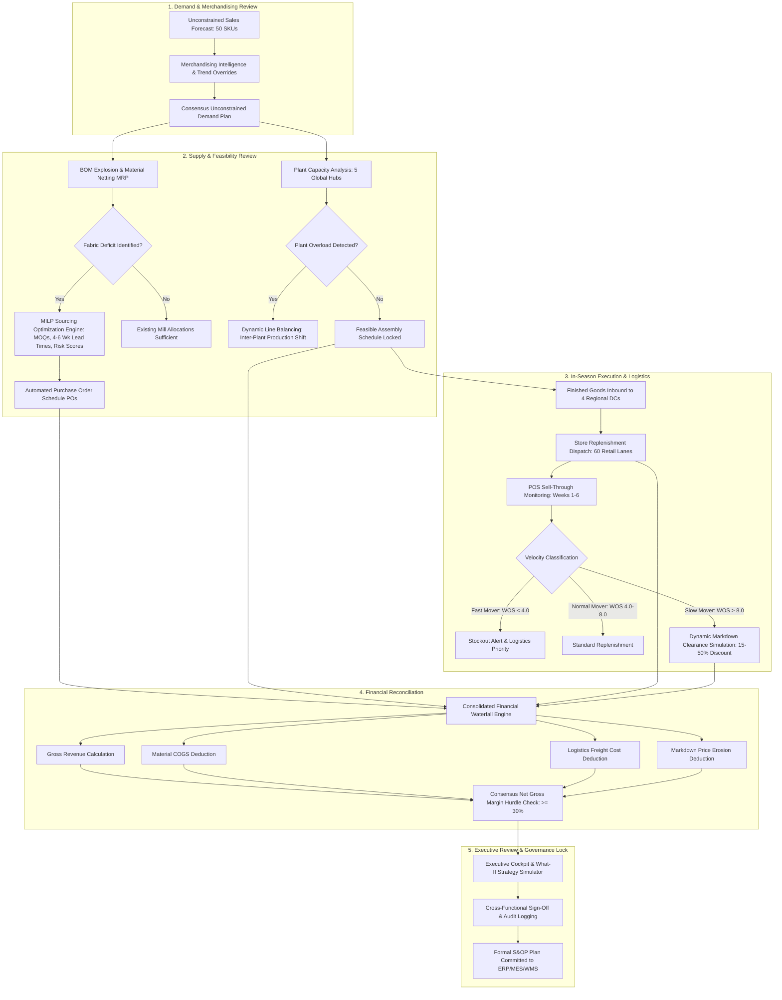
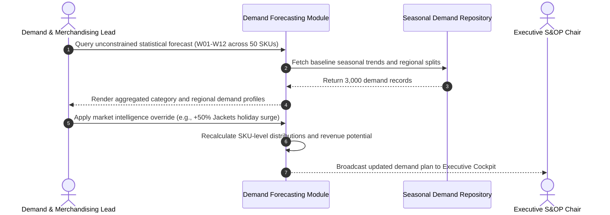
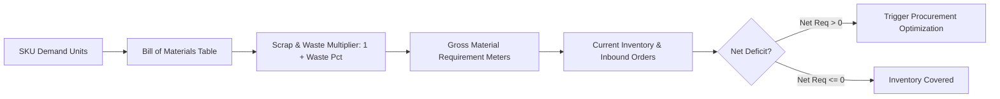
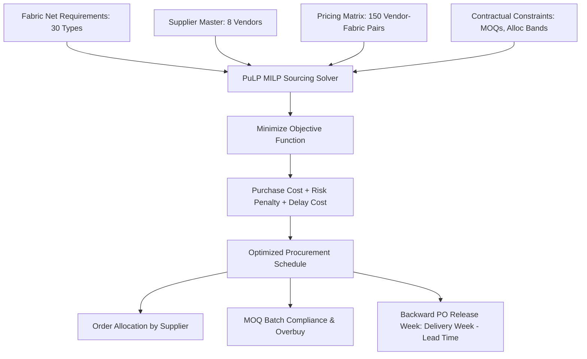
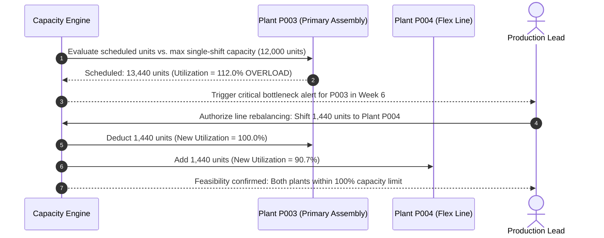
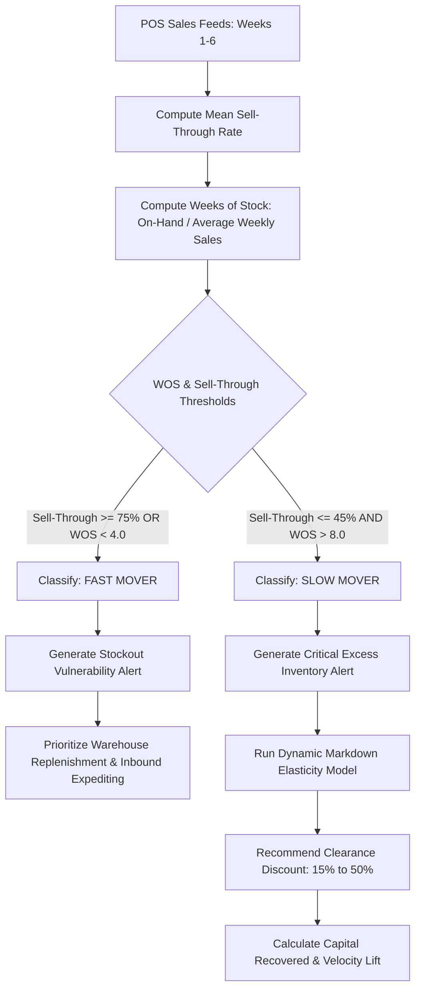
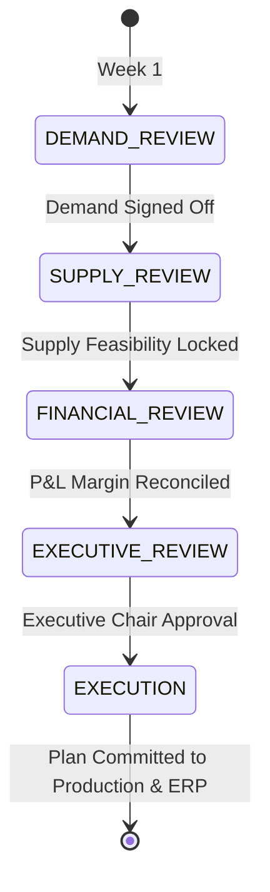

# TrendWear Integrated S&OP Enterprise Suite
## Document 2: Core Business Flows and Decision Framework

---

### 1. Executive Process Summary

The TrendWear Integrated Sales and Operations Planning (S&OP) framework establishes a deterministic, multi-echelon business process that connects commercial demand forecasts with physical supply execution and executive financial governance.

The platform executes eight core operational flows:
1. **Commercial Demand Forecasting & Merchandising Overrides**
2. **Multi-Echelon Bill of Materials (BOM) Explosion & MRP Netting**
3. **Risk-Aware Mixed-Integer Linear Programming (MILP) Sourcing Optimization**
4. **Plant Capacity Scheduling, Bottleneck Detection & Dynamic Line Balancing**
5. **In-Season Sell-Through Velocity Monitoring & Dynamic Markdown Elasticity**
6. **DC-to-Store Logistics, Transportation Lanes & Fulfillment SLAs**
7. **Consolidated Financial Waterfall Reconciliation (P&L Hurdle Verification)**
8. **5-Stage Monthly S&OP Consensus Cadence & Governance Audit Ledger**

---

### 2. End-to-End S&OP Operational Flowchart



---

### 3. Detailed Business Flow Specifications

#### Flow 1: Commercial Demand Forecasting & Merchandising Overrides



* **Business Objective**: Establish the unconstrained commercial target while accommodating merchandising trend adjustments.
* **Input Parameters**:
  - Statistical time-series forecast per SKU, region, and week ($50\text{ SKUs} \times 5\text{ Regions} \times 12\text{ Weeks}$).
  - Full-price MSRP per SKU ($29.50 to $149.00).
* **Decision Rules**:
  - Overrides can be executed at the style/SKU level or broad category level.
  - When an override is submitted, the system automatically recalculates projected revenue:
$$\text{Projected Revenue} = \sum_{\text{SKU}} \text{New Demand Units} \times \text{Unit Retail Price}$$
  - The updated demand matrix is passed immediately to the BOM Netting engine to cascade changes.
  - Real-time client-side table filtering dynamically recalculates visible SKU count, total units, and average price.

---

#### Flow 2: Multi-Echelon BOM Netting & Material Requirements Planning (MRP)



* **Business Objective**: Translate finished garment sales targets into exact linear meter requirements for 30 raw fabric types, factoring in cutting table yield loss and existing stock.
* **Calculation Engine**:
  1. **Gross Explosion**:
$$\text{Gross Requirement}_{f, t} = \sum_{s \in \text{SKUs using } f} \text{Demand}_{s, t} \times \text{UsagePerUnit}_{s, f} \times (1 + \text{ScrapRate}_{s, f})$$
  2. **Netting Formulation**:
$$\text{Net Requirement}_{f, t} = \max\left(0, \text{Gross Requirement}_{f, t} + \text{SafetyStock}_f - \text{OnHand}_f - \text{InboundReceipts}_{f, t}\right)$$
* **Operational Outputs**:
  - 450 fabric-period balance sheets.
  - Inventory coverage ratio:
$$\text{Coverage Pct} = \frac{\text{OnHand} + \text{InboundReceipts}}{\text{Gross Requirement} + \text{SafetyStock}} \times 100$$
  - Critical fabric deficit alerts.

---

#### Flow 3: Mixed-Integer Linear Programming (MILP) Sourcing Optimization



* **Business Objective**: Allocate raw fabric order volumes across 8 global textile mills to minimize total landed cost and operational disruption risk while strictly respecting Minimum Order Quantities (MOQ) and delivery lead times.
* **Mathematical Formulation**:
  - **Decision Variables**:
    - $x_{s, f, t} \ge 0$: Continuous volume (meters) ordered from supplier $s$ for fabric $f$ in period $t$.
    - $y_{s, f, t} \in \{0, 1\}$: Binary indicator whether an order is placed ($y = 1$) or not ($y = 0$).
  - **Objective Function**:
$$\min Z = \sum_{s, f, t} \left( \text{Price}_{s, f} \cdot x_{s, f, t} + \lambda_{\text{risk}} \cdot \text{RiskScore}_s \cdot x_{s, f, t} + \lambda_{\text{delay}} \cdot \text{LeadTimeVariance}_s \cdot x_{s, f, t} \right)$$
  - **Subject to Constraints**:
    1. **Demand Satisfaction**: $\sum_{s} x_{s, f, t} \ge \text{Net Requirement}_{f, t} \quad \forall f, t$
    2. **Minimum Order Quantity (MOQ)**: $\text{MOQ}_{s, f} \cdot y_{s, f, t} \le x_{s, f, t} \le \text{MaxCapacity}_{s, f, t} \cdot y_{s, f, t} \quad \forall s, f, t$
    3. **Supplier Allocation Banding**: $\text{MinAllocPct}_{s, f} \cdot \sum_i x_{i, f, t} \le x_{s, f, t} \le \text{MaxAllocPct}_{s, f} \cdot \sum_i x_{i, f, t}$
* **Lead Time Backward Scheduling**:
$$\text{PO Release Week} = \text{Target Delivery Week} - \text{Supplier Lead Time Weeks}$$
* **Interactive Sourcing & Live MOQ Validation**:
  - Sourcing sliders calculate allocated meters in real time: $\text{AllocatedMeters}_s = \text{NetRequirement} \times (\text{SliderPct}_s / 100)$.
  - If $\text{AllocatedMeters}_s > 0$ and $\text{AllocatedMeters}_s < \text{MOQ}_s$, a visual `⚠️ Sub-MOQ` badge is triggered.
  - Sourcing interface includes a live summary banner displaying Net Required Meters, Standard Lead Time, and Allocated Share.
  - Universal PO modal supports 1-click **"Download PO (CSV)"** and **"Copy Summary"** actions.

---

#### Flow 4: Plant Production Capacity Scheduling & Dynamic Line Balancing



* **Business Objective**: Match garment assembly schedules with plant capabilities across 5 manufacturing hubs, preventing line overloads and avoiding costly emergency air freight.
* **Utilization Formula**:
$$\text{Utilization Pct} = \frac{\text{Allocated Units}}{\text{Max Units Capacity}} \times 100$$
* **Capacity Status Classification**:
  - `OPTIMAL`: $\text{Utilization} \le 85.0\%$
  - `WARNING`: $85.0\% < \text{Utilization} \le 100.0\%$
  - `OVERLOADED`: $\text{Utilization} > 100.0\%$
* **Inter-Plant Shifting Rule**: When a plant exceeds 100%, volume can be shifted to designated flex-capacity plants (`P004` or `P005`) up to their available slack.
* **Persistent Disk Synchronization**: Authorized shifts atomically write updated capacities to `plant_production_capacity.csv` ensuring persistence across server restarts.

---

#### Flow 5: In-Season Sell-Through Velocity Monitoring & Dynamic Markdowns



* **Business Objective**: Respond to in-season selling trends during the 6-week window to prevent stockouts on fast sellers and accelerate cash recovery on slow-moving styles before season end.
* **Weeks of Stock (WOS) Calculation**:
$$\text{Weeks of Stock (WOS)} = \frac{\text{Current On-Hand Stock Units}}{\text{Average Weekly Sales Units}}$$
* **Dynamic Markdown Elasticity Model**:
$$\text{Clearance Ratio} = \min\left(1.0, 0.20 + (\text{Discount Depth Pct} \times 0.016)\right)$$
$$\text{Units Cleared} = \text{Excess Inventory Units} \times \text{Clearance Ratio}$$
$$\text{Recovered Capital} = \text{Units Cleared} \times \left(\text{Unit Cost} \times (1 - \text{Discount Depth Pct})\right)$$
$$\text{Velocity Lift} = (\text{Clearance Ratio} - 0.20) \times 450\%$$

---

#### Flow 6: DC-to-Store Logistics & Service Level Execution

* **Business Objective**: Maintain balanced stock across 4 regional DCs and optimize store replenishment lanes.
* **Logistics KPIs Monitored**:
  - DC Inventory Aging: Alerts triggered for styles aged $>45\text{ days}$.
  - Transport Lead Time: 1 to 6 days depending on lane distance.
  - Freight Cost per Unit: $1.20 to $4.80.
  - Target Service Level: $\ge 95\%$ On-Time In-Full (OTIF).

---

#### Flow 7: Consolidated Financial Waterfall Reconciliation

```mermaid
flowchart LR
    A[Gross Sales Revenue: +$53.48M] --> B[Material COGS: -$25.58M]
    B --> C[Logistics & Freight: -$4.39M]
    C --> D[Markdown Erosion: -$5.84M]
    D --> E[Consensus Gross Margin: $17.67M (33.0%)]
```

* **Business Objective**: Bridge commercial top-line aspirations with bottom-line gross margin hurdles.
* **Financial Formulas**:
$$\text{Gross Revenue} = \sum (\text{Forecasted Units} \times \text{Unit MSRP})$$
$$\text{Net Gross Margin} = \text{Gross Revenue} - \text{Material COGS} - \text{Logistics Freight} - \text{Markdown Erosion}$$
$$\text{Gross Margin Pct} = \frac{\text{Net Gross Margin}}{\text{Gross Revenue}} \times 100$$
* **Hurdle Constraint**: S&OP plans must achieve a minimum consensus gross margin hurdle of **30.0%**. Current baseline delivers **33.0%**.

---

#### Flow 8: 5-Stage Monthly S&OP Consensus Cadence & Governance



* **Cadence Stages**:
  1. **Demand Review**: Merchandising signs off unconstrained sales forecast and promotional plans.
  2. **Supply Review**: Procurement and Production validate fabric arrivals and plant capacities.
  3. **Financial Review**: Finance validates COGS, logistics expenses, markdown impacts, and gross margin hurdle.
  4. **Executive Review**: Executive S&OP Chair evaluates strategic trade-offs using What-If simulator (includes 1-click **"Reset to Baseline"** capability).
  5. **Execution & Lock**: Authorized decisions logged with tamper-evident audit timestamps and released to ERP/MES.
