# TrendWear Integrated S&OP Enterprise Suite
## Document 1: Dataset Specification and Data Dictionary

---

### 1. Domain Context and Data Modeling Rationale

The TrendWear supply chain operates on a fast-fashion apparel model characterized by:
- A compressed **6-week product lifecycle** from launch to final clearance.
- A **4 to 6-week fabric lead time** from Tier-1 textile mills, creating operational rigidity before finished garment assembly can begin.
- A **multi-echelon supply network** comprising:
  - 50 Finished Stock Keeping Units (SKUs) across 6 garment categories.
  - 30 Raw Material Fabric items with variable scrap and yield loss factors.
  - 8 Global Fabric Suppliers spanning North America, Europe, East Asia, and South Asia.
  - 5 Manufacturing Facilities (Plants) with fixed weekly capacity and overtime/flex limits.
  - 4 Regional Distribution Centers (DCs) serving 60 retail and e-commerce nodes.

The datasets are structured into relational schemas designed to eliminate manual spreadsheet silos and support deterministic mathematical optimization, multi-echelon material netting, and real-time scenario simulation.

---

### 2. Entity-Relationship Diagram (ERD)

```mermaid
erDiagram
    SKU_MASTER ||--o{ BOM_MATERIAL : "consumed by"
    SKU_MASTER ||--o{ SEASONAL_SKU_DEMAND : "forecasted in"
    SKU_MASTER ||--o{ CURRENT_INVENTORY : "stored as"
    SKU_MASTER ||--o{ HISTORICAL_SELL_THROUGH : "tracked in"
    SKU_MASTER ||--o{ HISTORICAL_MARKDOWNS : "discounted in"
    
    FABRIC_MASTER ||--o{ BOM_MATERIAL : "specifies"
    FABRIC_MASTER ||--o{ SUPPLIER_MATERIAL_PRICING : "priced by"
    FABRIC_MASTER ||--o{ SUPPLIER_CONTRACTS : "governed by"
    FABRIC_MASTER ||--o{ SUPPLIER_CAPACITY : "supplied in"
    FABRIC_MASTER ||--o{ FABRIC_CONSTRAINTS : "processed at"
    
    SUPPLIER_MASTER ||--o{ SUPPLIER_MATERIAL_PRICING : "offers"
    SUPPLIER_MASTER ||--o{ SUPPLIER_CONTRACTS : "holds"
    SUPPLIER_MASTER ||--o{ SUPPLIER_CAPACITY : "commits"
    
    PLANT_MASTER ||--o{ PLANT_PRODUCTION_CAPACITY : "allocated across"
    PLANT_MASTER ||--o{ FABRIC_CONSTRAINTS : "limits"
    
    DC_MASTER ||--o{ DC_TO_STORE_LOGISTICS : "dispatches via"
    DC_MASTER ||--o{ CURRENT_INVENTORY : "maintains"

    SOP_DECISIONS ||--|| FINANCIAL_PNL : "reconciles"
```

---

### 3. Comprehensive Dataset Specifications

#### 3.1. Master Data Layer

##### 3.1.1. `data/master/sku_master.csv`
* **Purpose**: Defines the catalog of finished apparel styles, pricing structures, and lifecycle metadata.
* **Cardinality**: 50 tuples (50 unique SKUs).
* **Primary Key**: `sku_id`

| Attribute | Data Type | Unit / Format | Domain / Range | Description and Business Representation |
|---|---|---|---|---|
| `sku_id` | String | `SKU_XXX` | `SKU_001` to `SKU_050` | Unique alphanumeric identifier for finished apparel item. |
| `sku_name` | String | Text | E.g., "Slim Fit Denim" | Commercial product name. |
| `category` | String | Categorical | `Jackets`, `Outerwear`, `Shirts`, `Trousers`, `Dresses`, `Knitwear` | Merchandising department classification. |
| `season` | String | Categorical | `Fall/Winter 2026`, `Spring/Summer 2026` | Collection season identifier. |
| `region_group` | String | Categorical | `GLOBAL`, `NA`, `EU`, `APAC` | Primary commercial distribution market. |
| `unit_retail_price` | Decimal | USD ($) | 29.50 to 149.00 | Initial full-price manufacturer suggested retail price (MSRP). |
| `unit_target_margin` | Decimal | Percentage (0.0–1.0) | 0.45 to 0.65 | Target gross margin hurdle rate established by finance. |
| `launch_week` | String | `WXX` | `W01` to `W06` | Calendar week of product release to stores. |
| `lifecycle_status` | String | Categorical | `LAUNCH`, `ACTIVE`, `MATURE`, `PHASE_OUT` | Product lifecycle management (PLM) stage. |

* **Design Rationale**: Apparel margins vary widely between structured outerwear ($55–65%) and basic shirts ($45–50%). Capturing launch week and lifecycle status allows the MRP engine to schedule backward procurement deadlines.

---

##### 3.1.2. `data/master/fabric_master.csv`
* **Purpose**: Defines raw textile materials required for finished garments, baseline costs, and supplier lead times.
* **Cardinality**: 30 tuples (30 unique raw materials).
* **Primary Key**: `fabric_id`

| Attribute | Data Type | Unit / Format | Domain / Range | Description and Business Representation |
|---|---|---|---|---|
| `fabric_id` | String | `FAB_XXX` | `FAB_001` to `FAB_030` | Unique raw material identifier. |
| `fabric_name` | String | Text | E.g., "Heavyweight Wool Blend" | Technical textile trade name. |
| `fabric_type` | String | Categorical | `WOVEN`, `KNIT`, `DENIM`, `SYNTHETIC`, `TECHNICAL` | Weaving and material classification. |
| `standard_cost_per_meter` | Decimal | USD ($/meter) | 4.20 to 28.50 | Standard accounting purchasing cost per linear meter. |
| `standard_lead_time_weeks` | Integer | Weeks | 4 to 6 | Baseline procurement lead time from mill order to port delivery. |
| `safety_stock_meters` | Integer | Linear Meters | 1,000 to 12,000 | Buffer inventory required to absorb demand surges and mill delays. |
| `criticality` | String | Categorical | `HIGH`, `MEDIUM`, `LOW` | Operational risk weighting based on single-source vulnerability. |

* **Design Rationale**: 4–6 week lead times represent the primary bottleneck in fast-fashion apparel. Criticality tags allow the MILP sourcing optimizer to penalize single-source dependencies.

---

##### 3.1.3. `data/master/bom_material.csv`
* **Purpose**: Relational mapping between finished SKUs and raw fabric consumption.
* **Cardinality**: 66 tuples (multi-fabric assembly mapping).
* **Primary Key**: Composite (`sku_id`, `fabric_id`)
* **Foreign Keys**: `sku_id` $\rightarrow$ `sku_master.sku_id`, `fabric_id` $\rightarrow$ `fabric_master.fabric_id`

| Attribute | Data Type | Unit / Format | Domain / Range | Description and Business Representation |
|---|---|---|---|---|
| `sku_id` | String | `SKU_XXX` | Valid `sku_id` | Finished garment reference. |
| `fabric_id` | String | `FAB_XXX` | Valid `fabric_id` | Raw fabric component reference. |
| `fabric_per_unit_meters` | Decimal | Meters / Unit | 0.85 to 3.40 | Net fabric consumption per single finished unit. |
| `waste_pct` | Decimal | Percentage (0.0–1.0) | 0.03 to 0.08 | Cutting room scrap and selvage loss allowance (3% to 8%). |

* **Design Rationale**: Gross material requirements must incorporate cutting table scrap factors:
Gross Requirement = Demand Units * Fabric Per Unit * (1 + Waste Pct)

---

##### 3.1.4. `data/master/supplier_master.csv`
* **Purpose**: Profiles Tier-1 textile mills, performance history, and composite operational risk metrics.
* **Cardinality**: 8 tuples (`S001` to `S008`).
* **Primary Key**: `supplier_id`

| Attribute | Data Type | Unit / Format | Domain / Range | Description and Business Representation |
|---|---|---|---|---|
| `supplier_id` | String | `SXXX` | `S001` to `S008` | Unique supplier identifier. |
| `supplier_name` | String | Text | E.g., "Apex Textile Mills" | Commercial entity name. |
| `supplier_status` | String | Categorical | `PREFERRED`, `APPROVED`, `CONDITIONAL` | Vendor qualification status. |
| `base_risk_factor` | Decimal | Index (0.0–1.0) | 0.05 to 0.35 | Baseline macroeconomic/geopolitical risk score. |
| `quality_score` | Decimal | Percentage (0.0–1.0) | 0.88 to 0.99 | First-pass quality inspection acceptance rate. |
| `otd_score` | Decimal | Percentage (0.0–1.0) | 0.72 to 0.98 | Historical On-Time Delivery (OTD) service level. |
| `average_lead_time_weeks` | Decimal | Weeks | 4.0 to 6.2 | Mean observed fulfillment lead time. |
| `lead_time_variability_weeks`| Decimal | Weeks (StdDev) | 0.2 to 1.4 | Historical delivery variance. |
| `financial_risk_score` | Decimal | Index (0.0–1.0) | 0.05 to 0.40 | Credit and liquidity risk index (Dun & Bradstreet aligned). |
| `capacity_tier` | String | Categorical | `TIER_1`, `TIER_2`, `TIER_3` | Volume manufacturing scale tier. |
| `risk_category` | String | Categorical | `LOW`, `MODERATE`, `HIGH` | S&OP composite risk tier. |

* **Design Rationale**: Low-cost suppliers (e.g. `S004`) frequently demonstrate lower OTD (72%) and higher lead-time variance (1.4 weeks). The optimizer explicitly balances price against risk penalty.

---

##### 3.1.5. `data/master/supplier_material_pricing.csv`
* **Purpose**: Contracted pricing grid by supplier and fabric code.
* **Cardinality**: 150 tuples (average of 5 qualified suppliers per fabric).
* **Primary Key**: Composite (`supplier_id`, `fabric_id`)
* **Foreign Keys**: `supplier_id` $\rightarrow$ `supplier_master.supplier_id`, `fabric_id` $\rightarrow$ `fabric_master.fabric_id`

| Attribute | Data Type | Unit / Format | Domain / Range | Description and Business Representation |
|---|---|---|---|---|
| `supplier_id` | String | `SXXX` | Valid `supplier_id` | Vendor reference. |
| `fabric_id` | String | `FAB_XXX` | Valid `fabric_id` | Raw fabric reference. |
| `price_per_meter` | Decimal | USD ($/meter) | 3.80 to 32.00 | Negotiated unit purchase price. |
| `currency` | String | ISO 4217 | `USD` | Transaction currency. |
| `price_valid_from` | Date | `YYYY-MM-DD` | `2026-01-01` | Contract pricing start date. |
| `price_valid_to` | Date | `YYYY-MM-DD` | `2026-12-31` | Contract pricing expiration date. |

---

##### 3.1.6. `data/master/supplier_contracts.csv`
* **Purpose**: Commercial terms including Minimum Order Quantities (MOQ) and capacity allocation bands.
* **Cardinality**: 150 tuples.
* **Primary Key**: Composite (`supplier_id`, `fabric_id`)

| Attribute | Data Type | Unit / Format | Domain / Range | Description and Business Representation |
|---|---|---|---|---|
| `supplier_id` | String | `SXXX` | Valid `supplier_id` | Vendor reference. |
| `fabric_id` | String | `FAB_XXX` | Valid `fabric_id` | Material reference. |
| `minimum_allocation_pct` | Decimal | Percentage (0.0–1.0) | 0.00 to 0.20 | Contractual guaranteed volume floor. |
| `maximum_allocation_pct` | Decimal | Percentage (0.0–1.0) | 0.40 to 1.00 | Risk diversification ceiling per supplier. |
| `minimum_order_qty_meters` | Integer | Linear Meters | 2,500 to 10,000 | Minimum batch run enforced by mill dyeing equipment. |
| `contract_expiry_date` | Date | `YYYY-MM-DD` | `2026-12-31` | Legal agreement termination date. |
| `committed_volume_meters` | Integer | Linear Meters | 5,000 to 50,000 | Annual volume commitment tier. |

* **Design Rationale**: MOQs force discrete batch sizing in procurement; buying below the MOQ is contractually prohibited, necessitating integer decision variables in the solver.

---

##### 3.1.7. `data/master/plant_master.csv`
* **Purpose**: Defines assembly manufacturing plants, operational regions, and flexibility parameters.
* **Cardinality**: 5 tuples (`P001` to `P005`).
* **Primary Key**: `plant_id`

| Attribute | Data Type | Unit / Format | Domain / Range | Description and Business Representation |
|---|---|---|---|---|
| `plant_id` | String | `PXXX` | `P001` to `P005` | Manufacturing facility identifier. |
| `plant_name` | String | Text | E.g., "Porto Assembly Hub" | Plant location name. |
| `region` | String | Categorical | `EMEA`, `AMER`, `APAC` | Geographical operating territory. |
| `production_type` | String | Categorical | `CUT_AND_SEW`, `FLEX_LINE`, `KNITWEAR_SPECIALIST` | Technical line capability. |
| `weekly_capacity_units` | Integer | Garment Units | 8,000 to 15,000 | Standard single-shift weekly production capacity. |
| `flex_capacity_pct` | Decimal | Percentage (0.0–1.0) | 0.10 to 0.25 | Overtime/shift surge capacity ceiling (10% to 25%). |

---

##### 3.1.8. `data/master/supplier_capacity.csv`
* **Purpose**: Weekly available capacity per supplier per fabric over the planning horizon.
* **Cardinality**: 1,800 tuples (8 suppliers * 30 fabrics * 12 weeks, filtered to qualified pairs).
* **Primary Key**: Composite (`supplier_id`, `fabric_id`, `period`)

| Attribute | Data Type | Unit / Format | Domain / Range | Description and Business Representation |
|---|---|---|---|---|
| `supplier_id` | String | `SXXX` | Valid `supplier_id` | Vendor reference. |
| `fabric_id` | String | `FAB_XXX` | Valid `fabric_id` | Material reference. |
| `period` | String | `WXX` | `W01` to `W12` | Planning week. |
| `max_supply_meters` | Integer | Linear Meters | 5,000 to 45,000 | Maximum mill weekly output allocated to TrendWear. |
| `committed_supply_meters` | Integer | Linear Meters | 0 to 30,000 | Capacity pre-booked for baseline production. |
| `available_supply_meters` | Integer | Linear Meters | 0 to 25,000 | Uncommitted spot capacity available for allocation. |

---

#### 3.2. Operational & Transactional Layer

##### 3.2.1. `data/demand/seasonal_sku_demand.csv`
* **Purpose**: Granular weekly demand forecast by SKU, sales region, and planning period.
* **Cardinality**: 3,000 tuples (50 SKUs * 5 Regions * 12 Weeks).
* **Primary Key**: Composite (`sku_id`, `region`, `period`)
* **Foreign Keys**: `sku_id` -> `sku_master.sku_id`

| Attribute | Data Type | Unit / Format | Domain / Range | Description and Business Representation |
|---|---|---|---|---|
| `sku_id` | String | `SKU_XXX` | Valid `sku_id` | Finished garment reference. |
| `region` | String | Categorical | `NORTH_AMERICA`, `EUROPE`, `ASIA_PACIFIC`, `LATIN_AMERICA`, `MIDDLE_EAST` | Commercial sales geography. |
| `period` | String | `WXX` | `W01` to `W12` | Calendar fiscal week. |
| `forecasted_demand_units` | Integer | Units | 150 to 3,500 | Unconstrained consensus sales forecast. |
| `forecast_version` | String | Text | `2026_M08_CONSENSUS` | Governance version tag. |
| `forecast_confidence` | Decimal | Percentage (0.0–1.0) | 0.70 to 0.95 | Statistical confidence score from demand sensing models. |

---

##### 3.2.2. `data/production/plant_production_capacity.csv`
* **Purpose**: Plant capacity utilization tracking by weekly production bucket.
* **Cardinality**: 60 tuples (5 plants * 12 weeks).
* **Primary Key**: Composite (`plant_id`, `period`)
* **Foreign Keys**: `plant_id` -> `plant_master.plant_id`

| Attribute | Data Type | Unit / Format | Domain / Range | Description and Business Representation |
|---|---|---|---|---|
| `plant_id` | String | `PXXX` | Valid `plant_id` | Manufacturing facility reference. |
| `period` | String | `WXX` | `W01` to `W12` | Operating week. |
| `max_units_capacity` | Integer | Units | 8,000 to 15,000 | Maximum capacity under standard operating shift. |
| `already_allocated_units`| Integer | Units | 4,500 to 16,800 | Garment units currently scheduled. |
| `maintenance_units` | Integer | Units | 0 to 1,200 | Planned line downtime allowance. |
| `available_units` | Integer | Units | -3,000 to 6,000 | Net capacity balance (negative indicates overload). |

---

##### 3.2.3. `data/inventory/current_inventory.csv`
* **Purpose**: Multi-location stock positions across all regional Distribution Centers.
* **Cardinality**: 200 tuples (50 SKUs * 4 DCs).
* **Primary Key**: Composite (`sku_id`, `location_id`)
* **Foreign Keys**: `sku_id` -> `sku_master.sku_id`

| Attribute | Data Type | Unit / Format | Domain / Range | Description and Business Representation |
|---|---|---|---|---|
| `sku_id` | String | `SKU_XXX` | Valid `sku_id` | Finished garment reference. |
| `location_id` | String | Categorical | `DC_NA_EAST`, `DC_EU_WEST`, `DC_APAC_SOUTH`, `DC_LATAM` | Distribution Center warehouse identifier. |
| `available_stock_units` | Integer | Units | 200 to 8,500 | Unrestricted inventory available for store dispatch. |
| `reserved_stock_units` | Integer | Units | 50 to 1,800 | Stock allocated to pending orders. |
| `safety_stock_threshold`| Integer | Units | 300 to 1,500 | Minimum inventory buffer to prevent stockouts. |
| `inbound_stock_units` | Integer | Units | 0 to 4,000 | Finished goods in transit from factories. |
| `inventory_age_days` | Integer | Days | 5 to 68 | Mean holding age since factory receipt. |

---

##### 3.2.4. `data/logistics/dc_to_store_logistics.csv`
* **Purpose**: Transportation lanes, transit lead times, and unit freight costs connecting DCs to retail regions.
* **Cardinality**: 60 tuples.
* **Primary Key**: Composite (`dc_id`, `store_id`)

| Attribute | Data Type | Unit / Format | Domain / Range | Description and Business Representation |
|---|---|---|---|---|
| `dc_id` | String | Categorical | Valid DC ID | Origin distribution hub. |
| `store_id` | String | `STR_XXX` | `STR_001` to `STR_060` | Destination store / fulfillment node. |
| `transportation_cost_per_unit`| Decimal| USD ($/unit) | 1.20 to 4.80 | Freight and handling cost per garment. |
| `transport_lead_time_days` | Integer | Days | 1 to 6 | Dispatch to shelf replenishment duration. |
| `service_level` | Decimal | Percentage (0.0–1.0) | 0.92 to 0.99 | Target On-Time In-Full (OTIF) fulfillment SLA. |

---

##### 3.2.5. `data/sales/historical_sell_through.csv`
* **Purpose**: In-season sales performance tracking velocity and inventory drawdown across retail stores.
* **Cardinality**: 600 tuples (50 SKUs * 12 historical selling weeks).
* **Primary Key**: Composite (`sku_id`, `selling_week`)

| Attribute | Data Type | Unit / Format | Domain / Range | Description and Business Representation |
|---|---|---|---|---|
| `sku_id` | String | `SKU_XXX` | Valid `sku_id` | Finished garment reference. |
| `selling_week` | String | `WXX` | `W01` to `W12` | In-season lifecycle week. |
| `units_available` | Integer | Units | 500 to 18,000 | Total stock placed in selling channels. |
| `units_sold` | Integer | Units | 80 to 4,200 | Point-of-sale customer purchases. |
| `sell_through_rate` | Decimal | Percentage (0.0–1.0) | 0.12 to 0.94 | Cumulative Sell-Through Ratio (Sold / Available). |
| `average_weekly_sales` | Decimal | Units/Week | 45.0 to 1,250.0 | Current sales run-rate velocity. |

---

##### 3.2.6. `data/sales/historical_markdowns.csv`
* **Purpose**: Empirical price elasticity and sales lift responses observed during past promotional events.
* **Cardinality**: 250 tuples (50 SKUs * 5 standard discount tiers: 10%, 20%, 30%, 40%, 50%).
* **Primary Key**: Composite (`sku_id`, `discount_percentage`)

| Attribute | Data Type | Unit / Format | Domain / Range | Description and Business Representation |
|---|---|---|---|---|
| `sku_id` | String | `SKU_XXX` | Valid `sku_id` | Finished garment reference. |
| `discount_percentage` | Decimal | Percentage (0.0–1.0) | 0.10 to 0.50 | Promotional discount depth (10% to 50%). |
| `units_sold_before_markdown`| Integer | Units/Week | 100 to 800 | Baseline sales velocity at full MSRP. |
| `units_sold_post_markdown` | Integer | Units/Week | 180 to 2,400 | Accelerated velocity under discount. |
| `sell_through_lift` | Decimal | Factor (x) | 1.35 to 4.20 | Empirical elasticity sales lift multiplier. |

---

##### 3.2.7. `data/outputs/sop_decisions.csv`
* **Purpose**: Audit ledger recording cross-functional S&OP decisions, rationale, financial impacts, and approver identity.
* **Cardinality**: 6 tuples (active cycle decisions).
* **Primary Key**: Composite (`sop_cycle_id`, `stage`)

| Attribute | Data Type | Unit / Format | Domain / Range | Description and Business Representation |
|---|---|---|---|---|
| `sop_cycle_id` | String | `CYCLE_YYYY_MXX` | `CYCLE_2026_M08` | Monthly S&OP governance cadence code. |
| `stage` | String | Categorical | `DEMAND_REVIEW`, `SUPPLY_REVIEW`, `FINANCIAL_REVIEW`, `EXECUTIVE_REVIEW`, `EXECUTION` | S&OP process stage. |
| `owner_role` | String | Text | E.g., "Demand & Merchandising Lead" | Departmental owner of the decision. |
| `decision` | String | Text | E.g., "Approve 50k Jacket Surge" | Actionable operational directive. |
| `status` | String | Categorical | `APPROVED`, `PENDING`, `REJECTED` | Governance sign-off state. |
| `reason` | String | Text | Free text justification | Empirical justification. |
| `financial_impact` | String | Text | USD ($) delta | Reconciled P&L variance. |
| `risk_impact` | String | Text | Text | Risk mitigation statement. |
| `approved_by` | String | Text | E.g., "Elena Rostova" | Executive authority sign-off. |
| `timestamp` | Timestamp | ISO 8601 | `2026-08-14 08:30:00` | Audit trail creation timestamp. |

---

### 4. Summary of Relational Schema Volume

| Layer | Datasets | Total Tuples (Rows) | Total Attributes (Cols) |
|---|---|---|---|
| Master Data Layer | 8 Datasets | 2,269 Rows | 56 Columns |
| Operational & Transactional Layer | 7 Datasets | 4,186 Rows | 43 Columns |
| Optimization & Engine Output Layer | 5 Datasets | 1,102 Rows | 79 Columns |
| **Consolidated Platform Total** | **20 Datasets** | **7,557 Rows** | **178 Columns** |
