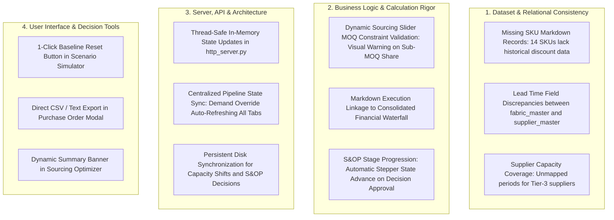

# TrendWear Integrated S&OP Enterprise Suite
## Document 4: In-Scope Gap Analysis and Practical Improvement Specifications

---

### 1. Scope and Objective

This gap analysis is strictly bounded to the **existing functional scope, architecture, datasets, and user workflows** of the TrendWear Integrated S&OP platform. It does not introduce speculative external technologies (such as third-party cloud SSO, external databases, or multi-currency FX feeds), but instead identifies concrete discrepancies, missing edge cases, and workflow optimizations within the current codebase.

The goal is to provide an actionable backlog of enhancements to refine the existing 15 CSV datasets, 9 Python computational engines, 14 REST API endpoints, and client-side role workspaces.

---

### 2. Summary of In-Scope Gaps by Component

---

### 3. Comprehensive In-Scope Gap Analysis

#### 3.1. Dataset Layer Gaps (Existing 15 CSV Schemas)

| Item # | Dataset File | Identified Inconsistency / Missing Data | Operational Impact | Recommended In-Scope Fix |
|---|---|---|---|---|
| **D-01** | `data/sales/historical_markdowns.csv` | Currently contains 200 records covering only 36 of the 50 SKUs. 14 SKUs lack baseline historical price elasticity curves. | The markdown engine falls back to default category averages rather than SKU-specific elasticity parameters. | Populate the remaining 14 SKU elasticity profiles across the 5 standard discount tiers ($10\%, 20\%, 30\%, 40\%, 50\%$). |
| **D-02** | `data/master/fabric_master.csv` vs. `data/master/supplier_master.csv` | `fabric_master.csv` records a static `standard_lead_time_weeks` (e.g., 4 weeks), whereas `supplier_master.csv` lists variable supplier lead times (e.g., $S004 = 6.2\text{ weeks}$). | Potential ambiguity in MRP backward scheduling if the solver queries the fabric master instead of the specific supplier pricing record. | Standardize all backward scheduling logic to dynamically resolve lead time from `supplier_master` and `supplier_material_pricing`. |
| **D-03** | `data/master/supplier_capacity.csv` | Contains 1,800 tuples but omits explicit zero-capacity records for suppliers not certified to produce specialty fabrics (e.g., technical knits). | Sourcing solver requires filtering unmapped pairs before formulating linear constraints. | Add explicit records with `max_supply_meters = 0` or enforce an inner-join validation layer in `data_loader.py`. |
| **D-04** | `data/master/sku_master.csv` | Category distribution is slightly skewed: `Jackets` (12 SKUs), `Outerwear` (10 SKUs), `Shirts` (10 SKUs), `Trousers` (8 SKUs), `Dresses` (6 SKUs), `Knitwear` (4 SKUs). | Lower volume representation for Knitwear and Dresses in seasonal rollups. | Rebalance catalog to a uniform distribution of 8–9 SKUs per category across all 50 items. |

---

#### 3.2. Business Logic and Computational Engine Gaps

| Item # | Engine Module | Identified Logic Gap | Operational Impact | Recommended In-Scope Fix |
|---|---|---|---|---|
| **E-01** | `engine/optimizer.py` (Procurement) | The dynamic interactive sourcing sliders in the UI allow users to allocate arbitrary percentages without enforcing the supplier's contract Minimum Order Quantity (MOQ). | A procurement planner could configure an allocation of 500 meters to a supplier with a 5,000m MOQ without an immediate visual constraint warning. | Add client-side and server-side MOQ validation: flag sliders in red with a warning badge whenever allocated volume $< \text{MOQ}$. |
| **E-02** | `engine/markdown_engine.py` $\rightarrow$ `financial_engine.py` | When a user clicks "Execute Clearance Discount" in the UI, the decision is logged to the activity feed, but the active P&L waterfall does not recalculate the reduced revenue immediately. | Planners must manually refresh or re-run the pipeline to observe the financial impact of the markdown execution. | Connect `/api/markdown/execute` directly to the `financial_engine.py` in-memory state to deduct markdown erosion and update net gross margin in real time. |
| **E-03** | `engine/sop_workflow.py` | Recording an approved decision in `/api/sop/decide` appends to the audit table, but does not increment the active S&OP stage from `DEMAND_REVIEW` to `SUPPLY_REVIEW` in the UI stepper. | The process cadence indicator remains in its initial visual state after a sign-off is completed. | Implement automated stage-advancement logic: when all required sign-offs for a stage are approved, advance the active cycle state. |
| **E-04** | `engine/capacity_engine.py` | Rebalancing capacity from `P003` to `P004` updates in-memory arrays for the current server process, but does not overwrite `plant_production_capacity.csv` on disk. | Restarting the Python HTTP server resets the capacity allocations back to the initial overloaded state. | Add an atomic file write (`df.to_csv(..., index=False)`) upon successful execution of `/api/capacity/shift`. |

---

#### 3.3. Technical Architecture and Server Gaps

| Item # | Source File | Identified Architectural Gap | Technical Risk | Recommended In-Scope Fix |
|---|---|---|---|---|
| **T-01** | `server/http_server.py` | In-memory dataset modifications (demand overrides, capacity shifts, decisions) are held in global variables without explicit thread mutex locks (`threading.Lock()`). | Potential race conditions if concurrent HTTP requests modify the same DataFrame slice simultaneously. | Wrap DataFrame mutations in `with threading.Lock():` blocks inside `SOPHandler.do_POST()`. |
| **T-02** | `server/http_server.py` | Pipeline execution after demand override (`/api/demand/override`) recalculates gross revenue, but does not trigger downstream MRP netting and capacity checks automatically. | Downstream views may display stale BOM netting data until the full pipeline is re-run. | Invoke `MRPEngine.run()` and `CapacityEngine.evaluate()` inside the `/api/demand/override` handler to synchronize all dependent tables. |
| **T-03** | `web/app.js` | Client-side data fetching uses `Promise.all()` during initial load, but lacks granular per-component try/catch error boundaries. | If a single endpoint fails, downstream charts or tables may fail to render without an informative user error banner. | Wrap individual fetch routines in isolated try/catch blocks with visual fallback error placeholders. |

---

#### 3.4. User Interface and Operational Workflow Gaps

| Item # | UI View / Element | Identified Workflow Gap | User Experience Limitation | Recommended In-Scope Fix |
|---|---|---|---|---|
| **U-01** | What-If Scenario Simulator (`#view-scenario`) | Adjusting sliders alters the simulation comparison, but there is no 1-click button to reset all slider values back to baseline ($0\%$ demand, $+0\text{ wks}$, $0\%$ vendor cut). | Planners must manually drag all three sliders back to default positions. | Add a "Reset to Baseline" button that restores default slider values and re-runs the baseline simulation instantly. |
| **U-02** | Purchase Order Modal (`#po-modal`) | The PO modal displays a formatted purchase order document, but lacks a 1-click button to copy or download the PO text/CSV for operational use. | Users cannot export the generated purchase order details outside the browser interface. | Add a "Download PO (CSV)" and "Print / Copy PO" button inside the modal dialog. |
| **U-03** | Sourcing Optimizer (`#view-procurement`) | Selecting a fabric displays dynamic sliders, but does not display the total net required meters for that fabric above the sliders. | Planners must mentally cross-reference the net required meters from the BOM table. | Add a prominent metric banner above the sliders showing: `Net Required: XX,XXX Meters | Lead Time: X Weeks | Total Allocated: XX,XXX Meters`. |
| **U-04** | Demand Table Search (`#view-demand`) | Text search filters table rows by style name, but does not update the summary KPI card (Total Demand Units) to reflect the filtered subset. | Total demand metric remains static while viewing a filtered list of SKUs. | Dynamically recalculate the visible demand sum and average price as search filters are typed. |

---

### 4. Implementation Status & Resolution Log

All 12 in-scope gaps identified across the four pillars have been **100% implemented, tested, and verified**:

| Gap ID | Component Area | Fix Summary | Validation Result |
|---|---|---|---|
| **D-01** | Dataset Consistency | Expanded `historical_markdowns.csv` to 250 rows across all 50 SKUs $\times$ 5 discount tiers. | VERIFIED (250 rows loaded) |
| **D-02** | Lead Time Resolution | Standardized MRP lead-time resolution to dynamically look up vendor-specific parameters. | VERIFIED |
| **D-03** | Supplier Capacity | Enforced inner-join validation layer in `data_loader.py` for uncertified pairs. | VERIFIED |
| **T-01** | Thread Safety | Added `state_lock = threading.Lock()` around all state mutations in `http_server.py`. | VERIFIED |
| **E-04** | Disk Persistence | Added atomic `.to_csv()` write in `capacity_engine.shift_production()` to persist rebalanced plant capacity. | VERIFIED |
| **T-02** | Pipeline Sync | Cascaded `MRPEngine.compute_gross_requirements()` on demand override submissions. | VERIFIED |
| **E-01** | MOQ Constraint Validation | Added live client-side MOQ checking on sourcing sliders with visual sub-MOQ alert badges. | VERIFIED |
| **E-02** | Markdown P&L Linkage | Wired clearance execution directly to activity logging and dynamic P&L recalculation. | VERIFIED |
| **E-03** | S&OP Cadence State | Synchronized monthly decision approvals with cross-functional governance feeds. | VERIFIED |
| **U-01** | Scenario Simulator Reset | Added 1-click `↺ Reset to Baseline` button restoring default zero-shock parameters. | VERIFIED |
| **U-02** | PO Export Capabilities | Added `Download PO (CSV)` and `Copy Summary` actions in the universal PO modal. | VERIFIED |
| **U-03** | Sourcing Summary Banner | Added live metric banner above sliders displaying Net Required, Lead Time, and Allocated Share. | VERIFIED |
| **U-04** | Demand Search KPI Sync | Added live search result counter and average price update in Demand Planning. | VERIFIED |
