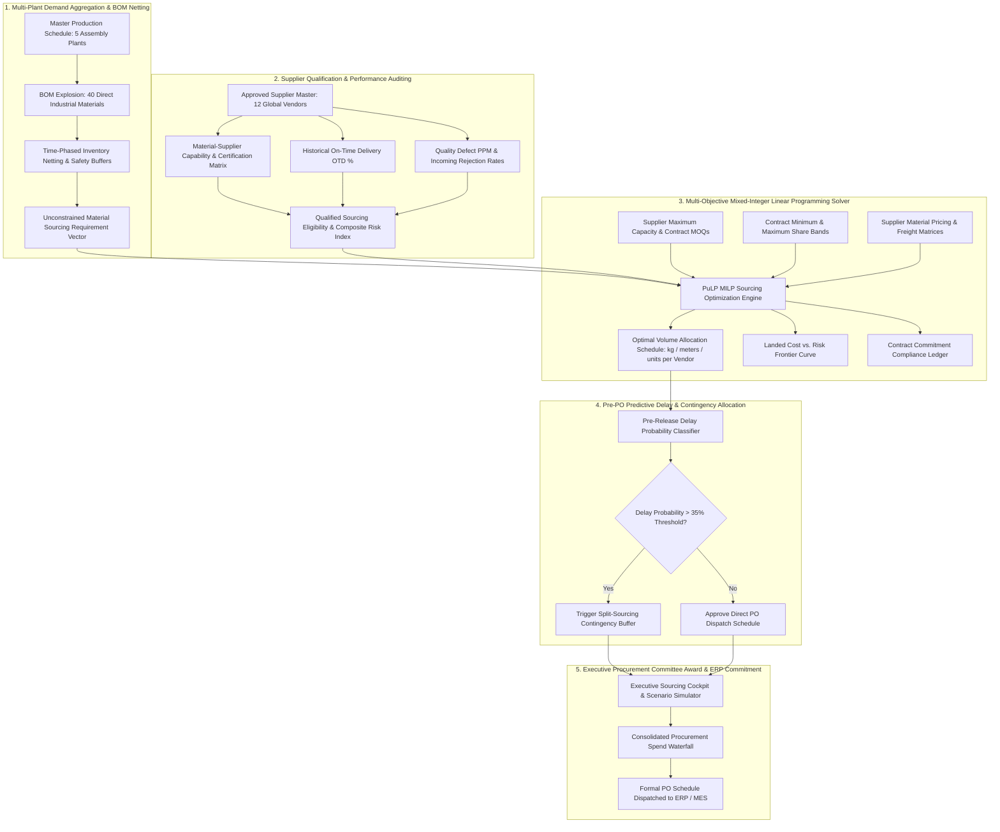
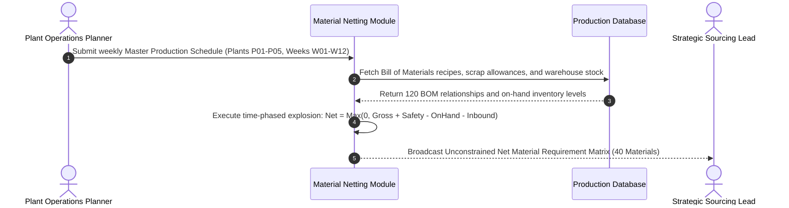
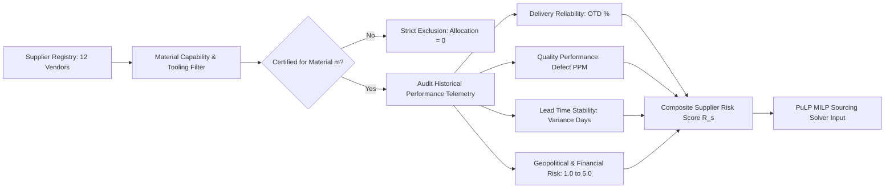
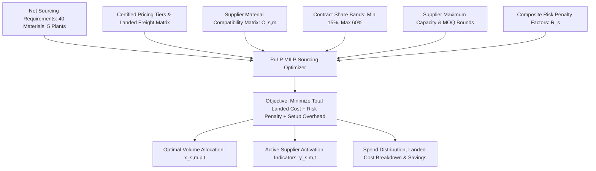
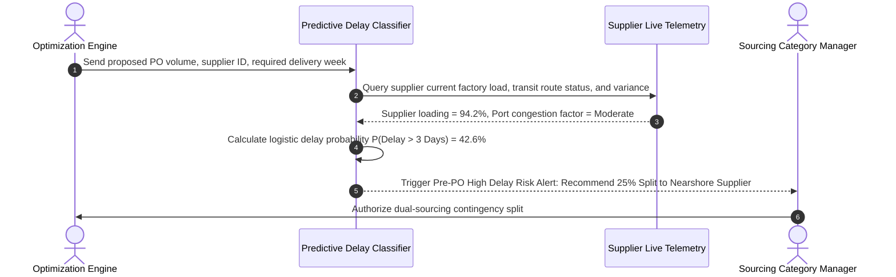
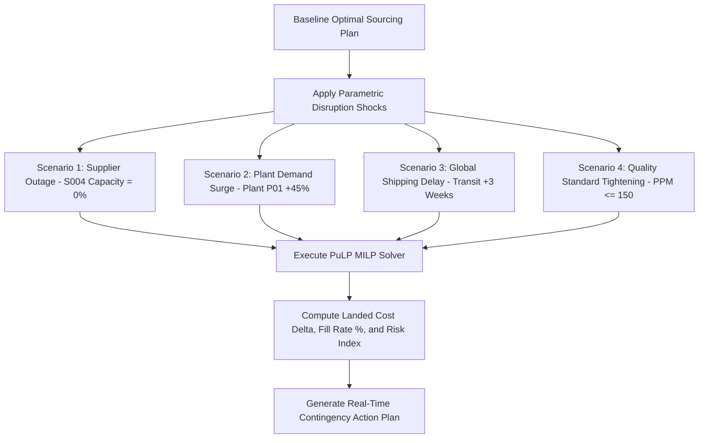
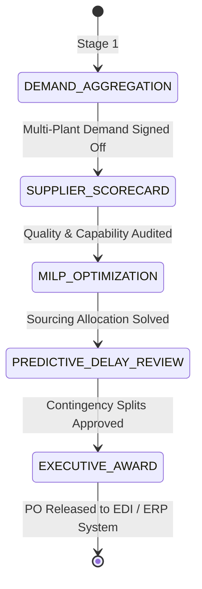

# Strategic Sourcing & Multi-Supplier Allocation Platform
## Document 2: Core Business Flows, Optimization Formulations and Decision Framework

---

### 1. Executive Summary and Problem Formulation

#### 1.1 Business Context
Global industrial manufacturing enterprises procure a diverse portfolio of direct raw materials, structural commodities, precision subassemblies, and specialized components across multiple operating assembly plants. Managing this supply ecosystem requires balancing landed procurement costs, supplier capacity limitations, lead-time dynamics, quality defect rates, and contractual diversification commitments.

#### 1.2 Core Operational Challenges
1. **Material-Supplier Capability Disconnects**: In industrial manufacturing, suppliers possess specialized manufacturing capabilities, tooling, and certifications. *Not every supplier can supply every material category*. Allocating demand to an uncertified or unqualified supplier results in immediate production halts.
2. **Cost vs. Reliability and Quality Trade-offs**: Selecting lowest-unit-cost vendors frequently leads to high lead-time variance, elevated parts-per-million (PPM) defect rates, and poor On-Time Delivery (OTD), which triggers downstream assembly plant shutdowns and emergency expedited freight expenses.
3. **Single-Source Concentration Vulnerability**: Over-allocating volume to a single low-cost vendor exposes manufacturing hubs to catastrophic disruptions in the event of factory fires, regional labor strikes, or financial insolvency.
4. **Contractual and Capacity Boundaries**: Procurement teams must satisfy contractually mandated minimum volume commitments (to preserve secondary sourcing relationships) while respecting vendor Maximum Weekly Production Capacities and contract Minimum Order Quantities (MOQs).
5. **Reactive Delay Management**: Delivery delays are traditionally identified only after confirmed dispatch dates have been missed. Procurement requires pre-release predictive risk modeling to proactively split purchase order volumes before release.

#### 1.3 Expected Strategic Outcomes
- **Deterministic Multi-Objective Allocation**: Optimally allocate procurement volumes across certified global suppliers using Mixed-Integer Linear Programming (MILP).
- **Landed Cost Minimization with Quality and Capacity Safeguards**: Minimize total landed cost (purchase price + freight + setup overhead) while enforcing quality thresholds ($\text{PPM} \le 250$), delivery reliability bounds ($\text{OTD} \ge 90\%$), and vendor capacity caps.
- **Contractual Diversification and Anti-Concentration**: Enforce contractual share bands (e.g., minimum 15% allocation for qualified secondary suppliers, maximum 60% cap on primary suppliers) to maintain resilient dual/multi-sourcing.
- **Pre-PO Predictive Delivery Delay Classification**: Compute pre-release delivery delay probabilities using supplier historical variance, plant backlog utilization, and logistics risk indicators.
- **Interactive Disruption Simulation**: Perform real-time What-If stress tests for supplier shutdowns ($-100\%$ capacity), plant demand surges ($+50\%$), and logistics transit shocks ($+3\text{ weeks}$).

---

### 2. End-to-End Strategic Sourcing Operational Architecture

---

### 3. Detailed Operational Steps and Mathematical Logic

#### Flow 1: Multi-Plant Material Demand Aggregation and BOM Netting

* **Business Objective**: Transform finished industrial product assembly targets across 5 manufacturing plants into exact raw material and component requirements across 40 direct materials.
* **Mathematical Formulation**:
For finished product SKU $k$, direct material $m$, manufacturing plant $p$, and planning week $t$:

$$\text{GrossRequirement}_{m, p, t} = \sum_{k} \left( \text{ProductionSchedule}_{k, p, t} \times \text{BOMUsage}_{k, m} \times (1 + \text{ScrapAllowancePct}_m) \right)$$

$$\text{NetRequirement}_{m, p, t} = \max\left(0, \text{GrossRequirement}_{m, p, t} + \text{SafetyStock}_{m, p} - \text{OnHandStock}_{m, p} - \text{ScheduledReceipts}_{m, p, t}\right)$$

* **Inventory Buffer Coverage Metrics**:
$$\text{InventoryCoverageRatio}_{m, p} = \left( \frac{\text{OnHandStock}_{m, p} + \text{ScheduledReceipts}_{m, p, t}}{\text{GrossRequirement}_{m, p, t} + \text{SafetyStock}_{m, p}} \right) \times 100$$

$$\text{WeeksOfSupply}_{m, p} = \frac{\text{OnHandStock}_{m, p}}{\overline{\text{WeeklyDemand}}_{m, p}}$$

---

#### Flow 2: Supplier Material Capability Matrix and Performance Auditing

* **Business Objective**: Enforce supplier qualification boundaries (*suppliers can only be allocated materials they are certified and tooled to produce*) and compute empirical reliability scores.
* **Material Capability Definition**:
Let $\mathcal{C}_{s, m} \in \{0, 1\}$ be the binary material compatibility parameter:
$$\mathcal{C}_{s, m} = \begin{cases} 1, & \text{if supplier } s \text{ is certified and approved to manufacture material } m \\ 0, & \text{otherwise} \end{cases}$$

* **Supplier Performance Scoring Metrics**:
  1. **Delivery Reliability Score ($S_{\text{OTD}, s}$)**:
$$S_{\text{OTD}, s} = \left( \frac{\text{Historical On-Time Deliveries}_s}{\text{Total Historical Shipments}_s} \right) \times 100$$

  2. **Quality Conformance Score ($S_{\text{Qual}, s}$)**:
$$S_{\text{Qual}, s} = \max\left(0, 100 - \frac{\text{Defective PPM}_s}{50}\right)$$

  3. **Composite Risk Index ($R_s$)**:
$$R_s = w_{\text{otd}} (100 - S_{\text{OTD}, s}) + w_{\text{qual}} (100 - S_{\text{Qual}, s}) + w_{\text{lt}} (\text{LeadTimeVarianceDays}_s \times 5) + w_{\text{geo}} (\text{FinancialGeoRisk}_s \times 20)$$
*(where weights $w_{\text{otd}} = 0.35, w_{\text{qual}} = 0.30, w_{\text{lt}} = 0.20, w_{\text{geo}} = 0.15$ and $\sum w_i = 1.0$)*.

---

#### Flow 3: Multi-Objective Mixed-Integer Linear Programming (MILP) Solver

* **Mathematical Optimization Formulation**:

  **Decision Variables**:
  - $x_{s, m, p, t} \ge 0$: Continuous quantity of material $m$ allocated to supplier $s$ for delivery to plant $p$ in week $t$.
  - $y_{s, m, t} \in \{0, 1\}$: Binary decision variable indicating whether supplier $s$ is actively contracted for material $m$ in week $t$ ($y=1$) or not ($y=0$).

  **Objective Function**:
$$\min Z = \sum_{s} \sum_{m} \sum_{p} \sum_{t} \left[ \left( \text{UnitPrice}_{s, m} + \text{FreightCost}_{s, p} \right) \cdot x_{s, m, p, t} + \lambda_{\text{risk}} \cdot R_s \cdot x_{s, m, p, t} \right] + \sum_{s} \sum_{m} \sum_{t} \left[ \text{OrderSetupCost}_{s, m} \cdot y_{s, m, t} \right]$$

  **Subject to Constraints**:
  1. **Demand Fulfillment Constraint**:
$$\sum_{s \in \text{Approved}(m)} x_{s, m, p, t} \ge \text{NetRequirement}_{m, p, t} \quad \forall m, p, t$$

  2. **Material Compatibility Restriction**:
$$x_{s, m, p, t} \le \text{BigM} \cdot \mathcal{C}_{s, m} \quad \forall s, m, p, t$$
*(Guarantees volume is zero if supplier $s$ is uncertified for material $m$)*.

  3. **Supplier Maximum Capacity Limit**:
$$\sum_{p} x_{s, m, p, t} \le \text{MaxCapacity}_{s, m, t} \cdot y_{s, m, t} \quad \forall s, m, t$$

  4. **Contract Minimum Order Quantity (MOQ)**:
$$\sum_{p} x_{s, m, p, t} \ge \text{MOQ}_{s, m} \cdot y_{s, m, t} \quad \forall s, m, t$$

  5. **Contractual Minimum Commitment and Diversification Bands**:
$$\text{MinCommitmentShare}_{s, m} \cdot \sum_{i} x_{i, m, p, t} \cdot y_{s, m, t} \le x_{s, m, p, t} \le \text{MaxAllocationCap}_{s, m} \cdot \sum_{i} x_{i, m, p, t}$$
*(e.g., Primary vendor capped at 60% maximum; qualified secondary vendor assigned at least 15% to preserve operational readiness)*.

  6. **Weighted Quality PPM Ceiling**:
$$\frac{\sum_{s} \left( \text{DefectPPM}_{s, m} \times \sum_p x_{s, m, p, t} \right)}{\sum_s \sum_p x_{s, m, p, t}} \le \text{TargetMaxPPM}_m \quad (\text{e.g., } \le 250\text{ PPM})$$

  7. **Lead-Time Backward Scheduling**:
$$\text{POReleaseWeek}(s, m, p, t) = t - \left\lceil \frac{\text{LeadTimeDays}_{s, m} + \text{TransitDays}_{s, p}}{7} \right\rceil$$

---

#### Flow 4: Pre-PO Predictive Delivery Delay Probability Engine

* **Predictive Delay Model Formulation**:
Prior to releasing purchase orders, compute the logistic probability that an order will experience a delivery delay exceeding acceptable transit tolerances ($\tau = 3\text{ days}$):

$$P(\text{Delay} > \tau) = \frac{1}{1 + \exp\left(-\left( \beta_0 + \beta_1 \cdot \text{CapacityUtilizationPct}_s + \beta_2 \cdot \text{LeadTimeVarianceDays}_s + \beta_3 \cdot \left(\frac{\text{AllocatedVolume}}{\text{MOQ}}\right) + \beta_4 \cdot \text{GeoRiskScore}_s \right)\right)}$$

* **Automated Action Thresholds**:
  - $P(\text{Delay}) \le 15.0\% \implies \mathbf{LOW\ RISK\ (GREEN)}$: Automatic Direct PO Dispatch.
  - $15.0\% < P(\text{Delay}) \le 35.0\% \implies \mathbf{MODERATE\ RISK\ (AMBER)}$: Buffer Transit Window by $+3\text{ Days}$.
  - $P(\text{Delay}) > 35.0\% \implies \mathbf{HIGH\ RISK\ (RED)}$: Enforce Mandatory Multi-Supplier Split Allocation.

---

#### Flow 5: Interactive What-If Disruption Simulation & Stress-Testing

* **Scenario Parameter Controls**:
  1. **Supplier Shutdown**: Simulate factory shutdown or regional embargo for any selected supplier ($0\%$ to $-100\%$ capacity).
  2. **Assembly Demand Surge**: Simulate unexpected manufacturing spikes ($0\%$ to $+100\%$ units).
  3. **Lead-Time Disruption**: Add $+1$ to $+4$ weeks to international transit lanes.
  4. **Quality Ceiling Filter**: Exclude all vendors exceeding strict defect limits ($\text{PPM} \le 150$).

---

#### Flow 6: 5-Stage Strategic Sourcing Governance Cadence

* **Governance Stages**:
  1. **Demand Aggregation**: Plant materials managers review unconstrained BOM explosion and inventory buffers.
  2. **Supplier Scorecarding**: Quality and procurement teams verify capability matrices, defect PPM, and ISO compliance.
  3. **MILP Sourcing Optimization**: Algorithmic engine solves cost-risk balance subject to MOQs and contractual share bands.
  4. **Predictive Delay Review**: Category buyers evaluate pre-PO delivery probabilities and enforce split-sourcing buffers.
  5. **Executive Award & Lock**: Chief Procurement Officer signs off the reconciled procurement plan with tamper-evident audit timestamps.

---

### 4. Relational Dataset Mapping and Data Dictionary

| Layer | File Path | Key Primary / Foreign Keys | Tuples | Description |
|---|---|---|---|---|
| Master | `data/master/material_master.csv` | `material_id`, `category`, `unit_of_measure` | 40 | Catalog of direct raw materials across 8 categories |
| Master | `data/master/supplier_master.csv` | `supplier_id`, `supplier_name`, `country`, `tier` | 12 | Approved global industrial supplier registry |
| Master | `data/master/plant_master.csv` | `plant_id`, `plant_name`, `location`, `capacity` | 5 | Manufacturing assembly plant hubs |
| Master | `data/master/bom_direct_materials.csv` | `sku_id`, `material_id`, `usage_qty`, `scrap_pct` | 120 | Bill of Materials recipe for finished industrial assemblies |
| Sourcing | `data/suppliers/supplier_material_pricing.csv`| `supplier_id`, `material_id`, `unit_price`, `moq` | 120 | Certified vendor pricing, MOQs, and lead times |
| Sourcing | `data/suppliers/supplier_capacity_limits.csv`| `supplier_id`, `material_id`, `period_week`, `cap` | 1,440 | Supplier max weekly production capacity limits |
| Sourcing | `data/suppliers/supplier_scorecards.csv` | `supplier_id`, `historical_otd_pct`, `defect_ppm` | 12 | Empirical supplier reliability, quality PPM, and risk ratings |
| Sourcing | `data/suppliers/contract_commitments.csv` | `supplier_id`, `material_id`, `min_share`, `max_share`| 120 | Contractual minimum and maximum allocation share bands |
| Operational | `data/demand/plant_material_demand.csv` | `material_id`, `plant_id`, `period_week`, `demand` | 2,400 | Weekly material demand forecast across 5 plants |
| Operational | `data/inventory/current_inventory.csv` | `material_id`, `plant_id`, `on_hand`, `safety_stock` | 200 | Plant warehouse stock balances and safety thresholds |
| Logistics | `data/logistics/freight_lane_matrix.csv` | `supplier_id`, `plant_id`, `transit_days`, `freight` | 60 | Inter-facility freight cost and transit times |
| Optimization | `data/outputs/optimized_sourcing_plan.csv`| `material_id`, `supplier_id`, `plant_id`, `alloc` | Dynamic | Solved optimal procurement purchase order plan |
| Optimization | `data/outputs/predictive_delay_alerts.csv` | `po_id`, `supplier_id`, `delay_prob`, `risk_level` | Dynamic | Pre-PO delivery delay risk predictions and alerts |
| Optimization | `data/outputs/sourcing_decisions.csv` | `cycle_id`, `stage`, `owner_role`, `decision`, `status`| Dynamic | Auditable executive sourcing decision ledger |

---

### 5. Cross-Functional RACI Responsibility Matrix

| Operational Workflow | Plant Materials | Sourcing Category Leads | Quality Engineering | Logistics & Freight | Chief Procurement Officer |
|---|---|---|---|---|---|
| **Demand Forecasting & Netting** | **Accountable (A)** | Consulted (C) | Informed (I) | Informed (I) | Informed (I) |
| **Capability Matrix & Scorecards** | Informed (I) | Responsible (R) | **Accountable (A)** | Informed (I) | Informed (I) |
| **MILP Sourcing Optimization** | Consulted (C) | **Accountable (A)** | Consulted (C) | Consulted (C) | Approver (A) |
| **Predictive Delay & Split-Sourcing**| Consulted (C) | **Accountable (A)** | Informed (I) | **Responsible (R)**| Informed (I) |
| **Contract Share & MOQ Compliance** | Informed (I) | **Accountable (A)** | Informed (I) | Informed (I) | Approver (A) |
| **Final Sourcing Award & PO Release** | Informed (I) | Responsible (R) | Informed (I) | Informed (I) | **Accountable (A)** |
