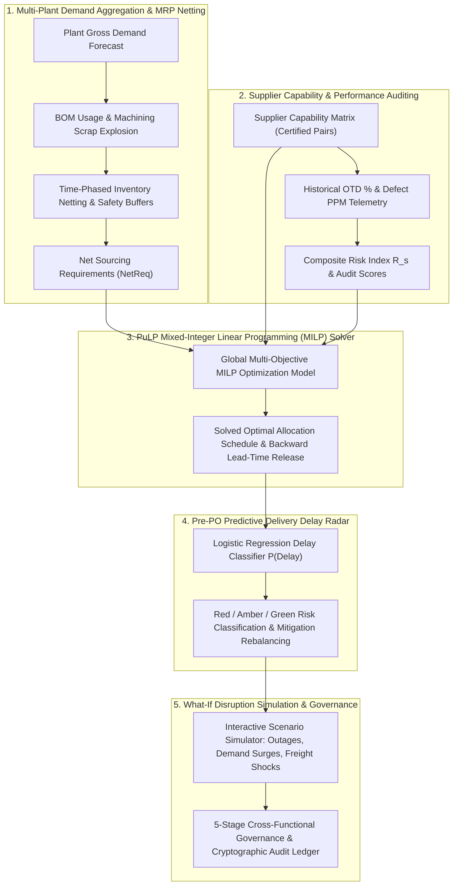
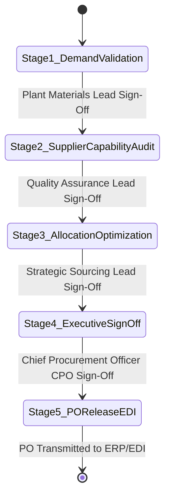

# TitanMfg™ Strategic Sourcing & Multi-Supplier Allocation Platform
## Document 2: Core Business Flows, Mathematical Formulations, and Decision Framework

---

### 1. Executive Summary & Problem Statement

**TitanMfg™ Strategic Sourcing Platform** orchestrates direct raw material procurement across 40 industrial material codes, 12 certified global suppliers, and 5 assembly manufacturing plants over a 12-week operational planning horizon.

In industrial manufacturing, strategic sourcing operates under multi-dimensional trade-offs:
1. **Landed Procurement Cost**: Minimizing contract purchase prices and multimodal freight expenses.
2. **Operational Continuity & Anti-Concentration**: Eliminating single-point-of-failure vulnerabilities through mandatory split-sourcing and Herfindahl-Hirschman Index (HHI) concentration limits.
3. **Quality Conformance Ceilings**: Preventing assembly line stoppages by enforcing strict Defect Parts Per Million (≤ 250 PPM) and audit score hurdles (≥ 85).
4. **Physical Supply Constraints**: Respecting vendor production capacity limits and contract Minimum Order Quantities (MOQs).
5. **Dynamic Lead-Time Synchronization**: Executing exact backward lead-time scheduling from dock-delivery date back to purchase order release date.

---

### 2. End-to-End Operational Architecture



---

### 3. Detailed Operational Steps & Mathematical Logic

#### Flow 1: Multi-Plant Material Demand Aggregation & MRP Netting

##### 1.1. Bill of Materials (BOM) Explosion
Given weekly assembly requirements for finished SKUs across 5 manufacturing facilities, gross material demand incorporates cutting and machining scrap allowances (2% to 8%):

```
GrossDemand[m, p, t] = Sum_k ( ProductionPlan[k, p, t] * UsageQty[k, m] * (1 + ScrapAllowance[k, m]) )
```

##### 1.2. Time-Phased Inventory Netting
Net raw material procurement requirements account for physical on-hand warehouse inventory and required safety stock buffers:

```
NetReq[m, p, t] = max(0, GrossDemand[m, p, t] + SafetyStock[m, p] - OnHand[m, p] - InTransit[m, p, t])
```

##### 1.3. Inventory Coverage Ratio and Weeks of Supply (WOS)
To monitor plant stock health before placing purchase orders:

```
InventoryCoverageRatio[m, p] = OnHand[m, p] / SafetyStock[m, p]

WeeksOfSupply[m, p] = OnHand[m, p] / ( (1/12) * Sum_{t=1..12} GrossDemand[m, p, t] )
```

---

#### Flow 2: Supplier Material Capability Matrix & Performance Auditing

##### 2.1. Certified Capability Matrix (`C[s, m]`)
A binary qualification parameter defines whether supplier `s` is certified to produce material `m`:
- `C[s, m] = 1` if supplier `s` is certified and tooling-validated for material `m`
- `C[s, m] = 0` otherwise

##### 2.2. Quality Conformance Score (`S_Qual`)
Quality audit scores combine incoming parts defect rates and annual engineering audits:

```
S_Qual(s) = 0.50 * (1 - DefectPPM[s] / 1,000,000) + 0.50 * (AuditScore[s] / 100)
```

##### 2.3. Composite Risk Index (`R_s`)
A unified risk metric weighting delivery variance, financial liquidity, and geopolitical exposure:

```
R_s = 0.40 * (1 - OTD[s]) + 0.35 * (LeadTimeVarianceDays[s] / 7.0) + 0.25 * (FinancialRiskScore[s] / 5.0)
```

---

#### Flow 3: Multi-Objective Mixed-Integer Linear Programming (PuLP MILP) Solver

##### 3.1. Decision Variables
- `x[s, m, p, t] ≥ 0`: Continuous volume of material `m` allocated to supplier `s` for delivery to plant `p` in week `t`.
- `y[s, m, p, t] ∈ {0, 1}`: Binary order activation indicator (`1` if an order is placed with supplier `s`, `0` otherwise).

##### 3.2. Objective Function Formulation
The optimization engine minimizes total landed cost, logistics freight, supplier risk penalties, and fixed PO order processing overhead:

```
Minimize Z = Sum_{s,m,p,t} [ (UnitPrice[s,m] + FreightCost[s,p]) * x[s,m,p,t]
                           + lambda_risk * R_s * StandardCost[m] * x[s,m,p,t]
                           + SetupCost * y[s,m,p,t] ]
```

*Where `lambda_risk = 0.15` is the risk trade-off weighting coefficient.*

##### 3.3. Linear Constraints
1. **Demand Satisfaction**:
   ```
   Sum_{s | C[s,m]=1} x[s, m, p, t] = NetReq[m, p, t]    (for all m, p, t)
   ```

2. **Supplier Weekly Production Capacity Limits**:
   ```
   Sum_p x[s, m, p, t] <= MaxCapacity[s, m, t] * y[s, m, p, t]    (for all s, m, t)
   ```

3. **Contract Minimum Order Quantities (MOQs)**:
   ```
   x[s, m, p, t] >= MOQ[s, m] * y[s, m, p, t]    (for all s, m, p, t)
   ```

4. **Multi-Sourcing Anti-Concentration Share Bands**:
   ```
   MinShare[s, m] * NetReq[m, p, t] * y[s, m, p, t] <= x[s, m, p, t] <= MaxShare[s, m] * NetReq[m, p, t]
   ```
   *(Typically enforced as `MinShare = 15%`, `MaxShare = 60%` to ensure dual-sourcing resilience).*

5. **Quality PPM Threshold**:
   ```
   Sum_s ( DefectPPM[s] * x[s, m, p, t] ) <= 250 * NetReq[m, p, t]    (for all m, p, t)
   ```

##### 3.4. Lead-Time Backward PO Scheduling
Purchase order dispatch dates are calculated backward from the target plant receipt week:

```
POReleaseWeek(s, m, p, t) = t - ceil( (LeadTimeDays[s, m] + TransitDays[s, p]) / 7 )
```

---

#### Flow 4: Pre-PO Predictive Delivery Delay Probability Engine

##### 4.1. Logistic Regression Delay Scoring Formulation
Before transmitting POs to ERP/EDI, each allocation is evaluated by a machine learning logistic scoring model predicting the probability of transit delay exceeding 3 days `P(Delay > 3d)`:

```
z = beta_0 + beta_1 * (1 - OTD[s]) + beta_2 * VarianceDays[s] + beta_3 * TransitDays[s, p] + beta_4 * (1 - LaneReliability[s, p]) + beta_5 * (x[s,m,p,t] / MOQ[s,m])

P(Delay > 3d) = 1 / (1 + exp(-z))
```

##### 4.2. Risk Tier Classification & Prescriptive Routing
| Risk Tier | Probability Threshold | Status Label | Automated Prescriptive Action |
|---|---|---|---|
| **GREEN** | `P(Delay) < 0.25` | Low Disruption Risk | Approve standard EDI purchase order release. |
| **AMBER** | `0.25 <= P(Delay) <= 0.50` | Moderate Lead-Time Variance | Schedule +3 day warehouse buffer or shift to expedited freight. |
| **RED** | `P(Delay) > 0.50` | Critical Delivery Bottleneck | Trigger split-sourcing reallocation to certified secondary supplier. |

---

#### Flow 5: Interactive What-If Disruption Simulation & Stress-Testing

Planners simulate macroeconomic shocks in sub-second real time:
1. **Supplier Shutdown / Outage**: Simulates complete shutdown (`Capacity = 0`) of a Tier-1 vendor (e.g., `SUP_001`). Re-optimizes across remaining certified vendors to evaluate landed spend cost surges.
2. **Plant Demand Spikes**: Injects +10% to +50% surges across automotive assembly hubs.
3. **Logistics Bottlenecks**: Adds +1 to +3 weeks of transit delay to trans-Pacific/trans-Atlantic maritime corridors.
4. **Quality Ceiling Purge**: Disqualifies vendors exceeding 150 PPM, demonstrating quality trade-offs.

---

#### Flow 6: 5-Stage Strategic Sourcing Governance Cadence & Audit Ledger



Each stage transition generates a tamper-evident audit record hashed with SHA-256:

```
AuditHash = SHA256( CycleID || Stage || Approver || Timestamp || FinancialImpact )
```

---

### 4. Cross-Functional RACI Responsibility Matrix

| Sourcing Workflow Step | David Miller (Plant Buyer) | Dr. Aris Thorne (Quality Lead) | Marcus Vance (Category Lead) | Robert Sterling (CPO) |
|---|---|---|---|---|
| **1. Demand & MRP Netting** | **Accountable (A)** | Informed (I) | Consulted (C) | Informed (I) |
| **2. Supplier Auditing & Scorecards**| Informed (I) | **Accountable (A)** | Consulted (C) | Informed (I) |
| **3. Sourcing Allocation & Sliders** | Consulted (C) | Consulted (C) | **Accountable (A)** | Informed (I) |
| **4. Pre-PO Delay Radar & Split-Sourcing**| Informed (I) | Consulted (C) | **Accountable (A)** | Informed (I) |
| **5. What-If Disruption Simulation** | Informed (I) | Informed (I) | **Responsible (R)** | **Accountable (A)** |
| **6. 5-Stage Governance Sign-Off** | Responsible (R) | Responsible (R) | Responsible (R) | **Accountable (A)** |
| **7. 1-Click PO Release to EDI** | **Accountable (A)** | Informed (I) | Informed (I) | **Accountable (A)** |
